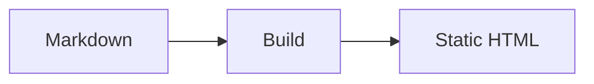

# Mermaid Diagrams

> Add themed diagrams that lildocs renders to static SVG during the build.

Use fenced `mermaid` code blocks:

````md

````


## Static Rendering

lildocs renders Mermaid diagrams during the build. Generated pages contain
static SVG and do not load Mermaid from a CDN or require Mermaid client
JavaScript.

Readers can expand a rendered diagram to fill the viewport. Diagram colors come
from the active Shiki theme and follow configured light and dark themes.

Invalid Mermaid syntax fails the build with the source page and diagram number
in the error message.

See [Themes and styling](../reference/theming.md) to configure the themes used
for syntax highlighting and diagrams.
