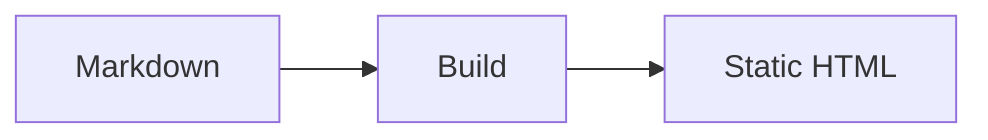

# Authoring Docs

> Structure Markdown source files so lildocs can infer titles, navigation,
> assets, callouts, diagrams, and search content.

Write normal Markdown files in a folder. lildocs uses that folder as the site
source and turns the file tree into navigation.

## Docs Root And Home Page

When the input is a folder, lildocs treats that folder as the docs root and
looks for a home page in this order:

1. `README.md`
2. `readme.md`
3. `index.md`
4. `intro.md`
5. `introduction.md`
6. `getting-started.md`
7. `quickstart.md`

If none of those files exists, the first Markdown file found in the folder tree
is used as the home page.

When the input is a Markdown file, that file becomes the home page and its
parent folder becomes the docs root:

```bash
lildocs ./docs/index.md
```

## Navigation

Navigation is generated from the folder structure. Nested folders become nested
navigation groups, and hidden or system files are ignored.

When the home page links to local Markdown documents, those pages are hoisted in
the sidebar in first-reference order unless `navigation.order` already covers
them. Unlinked pages continue to use generated folder order.

```text
docs/
  index.md
  getting-started.md
  guides/
    authoring.md
  reference/
    cli.md
```

That folder tree creates a top-level sidebar link for `getting-started.md`,
plus `Guides` and `Reference` groups. The home page is not repeated in the
sidebar; the generated header brand links back to it instead.

Multi-page sites also get previous and next links at the bottom of each page.
Those links follow the same generated page order as the sidebar:
`navigation.order` first, then home-page link order, then generated folder
order.

```json
{
  "navigation": {
    "order": ["getting-started.md", "guides/", "reference/"]
  }
}
```

Pages inside folders show a small group breadcrumb above the page content. The
labels come from the folder names:

```text
docs/
  guides/
    local-files.md
```

That page shows `Guides` before its content.

## Page Titles

Page titles are inferred in this order:

1. `title` in frontmatter
2. The first `h1`
3. The filename

Use frontmatter when the navigation label should differ from the visible page
heading:

```md
---
title: CLI Reference
---

# Command Line
```

## Page Subtitles

Place a plain blockquote immediately after the page `h1` to render short
supporting copy as a subtitle:

```md
# Command Line

> Choose the command and flags for building, previewing, or deploying docs.
```

Keep subtitles brief and descriptive. Blockquotes elsewhere on the page continue
to render as regular quoted notes unless they use GitHub-style callout syntax.

## Markdown Features

| Feature | Support |
| --- | --- |
| Standard Markdown | Supported |
| GitHub-flavored Markdown | Supported |
| Frontmatter | Supported |
| Syntax-highlighted fenced code blocks | Supported, with copy buttons |
| Heading anchors | Supported |
| H1-adjacent subtitle blockquotes | Supported |
| Relative Markdown links | Supported |
| Images and local assets | Supported |
| GitHub-style callouts | Supported |
| Mermaid diagrams | Supported out of the box |

## Links And Assets

Use normal relative Markdown links:

```md
Read the [CLI reference](../reference/cli.md).
```

Use normal Markdown images for local assets:

```md

```


Local assets referenced by Markdown are copied into the generated site.

## Callouts

Use GitHub-style blockquote callouts to highlight notes, tips, important
details, warnings, and cautions:

```md
> [!NOTE]
> Useful context for readers who are skimming.

> [!WARNING]
> Something readers should check before continuing.
```

Supported callout types are `NOTE`, `TIP`, `IMPORTANT`, `WARNING`, and
`CAUTION`.

> [!TIP]
> Callouts are rendered as regular static HTML and work without client-side
> JavaScript.

## Mermaid

Use fenced `mermaid` code blocks:

````md

````


Mermaid diagrams work out of the box. lildocs keeps client-side JavaScript
limited to search and progressive enhancement. Mermaid rendering happens during
the build, so generated pages contain static SVG and do not load Mermaid from a
CDN or require Mermaid client JavaScript. Invalid Mermaid syntax fails the build
with the page and diagram number in the error message.

## Search

Search is generated locally at build time from page titles, headings, and body
text. No external search service is required, and the generated search index is
emitted with the static site.

`h2` and `h3` sections get their own search entries, so results can point
directly at useful subsections:

```md
 ## Install

Run the package manager command.

 ### Local Files

Place screenshots in the docs folder and reference them with relative paths.
```

The search UI highlights matching terms, supports Arrow Up, Arrow Down, Enter,
and Escape, and prefetches local result pages while readers browse results.
