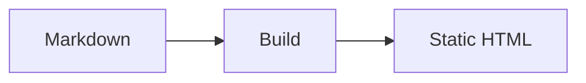

# lildocs Example

This example shows the main Markdown features used by the fixture documentation site.


## Quickstart

Run the CLI against this folder:

```bash
lildocs ./docs
```

Read the [authoring guide](guides/authoring.md) or browse the [CLI reference](reference/cli.md).

## Mermaid


