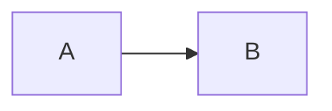

# Build-Time Mermaid Rendering Plan

## Goal

Render Mermaid code blocks to static SVG during `lildocs build`, instead of requiring browser-side Mermaid execution.

This should preserve the current authoring behavior:

````md

````

But generated HTML should contain ready-to-display SVG markup and should not load Mermaid from a CDN for successfully rendered diagrams.

## Current State

`src/core/markdown.ts` treats Mermaid as a special code block inside the `marked-shiki` highlighter:

```html
<pre class="mermaid">...</pre>
```

It returns `needsMermaid = true`.

`src/render/Layout.tsx` then emits:

- Mermaid CDN module script.
- `mermaid.initialize({ startOnLoad: true })`.

This works, but it means:

- Mermaid rendering requires client-side JavaScript.
- Static output depends on a CDN.
- Diagrams are not visible if JS is disabled.
- Mermaid failures happen in the browser instead of during build.

## Recommended Renderer

Use `beautiful-mermaid` for the first implementation.

Reasoning:

- It renders SVG without DOM setup.
- It is synchronous, which keeps the Markdown render pipeline simpler.
- It exposes Shiki theme integration through `fromShikiTheme`.
- It also accepts simple foreground/background/accent-style theme values, which maps well to lildocs tokens.
- Its smaller rendering surface is acceptable for lildocs' current Mermaid support.

Accepted caveat:

- `beautiful-mermaid` is not Mermaid's official renderer.
- It supports a practical subset of Mermaid diagram types rather than every Mermaid feature.
- lildocs should document that build-time Mermaid rendering supports the diagram types handled by `beautiful-mermaid`.

Fallback if compatibility becomes a blocker:

- Use official `mermaid` with `happy-dom`.
- Keep `@mermaid-js/mermaid-cli` as a last resort because it pulls in browser automation weight and complicates installation.

## Desired Output

For each Mermaid block, output:

```html
<figure class="mermaidDiagram">
  <svg ...>...</svg>
</figure>
```

For accessibility:

- If the code fence has a title/meta value later, use it as `<figcaption>`.
- For now, add `role="img"` to the SVG wrapper where practical.
- Preserve readable fallback source in an HTML comment only if useful for debugging; do not show raw Mermaid source on successful render.

For invalid Mermaid:

- Fail the build by default with a clear diagnostic including source file path and diagram index.
- Consider a future `--mermaid.on-error warn` option, but do not add it initially.

## Architecture

Add:

```text
src/core/mermaid.ts
```

Suggested exports:

```ts
export type MermaidRenderOptions = {
  themeConfig: MermaidThemeConfig;
};

export type MermaidThemeConfig = {
  bg: string;
  fg: string;
  accent?: string;
  muted?: string;
  surface?: string;
  border?: string;
  fontFamily?: string;
};

export type MermaidRenderer = {
  render: (source: string, idHint: string) => Promise<string>;
  close: () => Promise<void>;
};

export async function createMermaidRenderer(options: MermaidRenderOptions): Promise<MermaidRenderer>;
```

Keep this wrapper even if `beautiful-mermaid` is selected. The rest of the build pipeline should not care which renderer is underneath.

`createMermaidRenderer` should:

1. Import `renderMermaidSVG` from `beautiful-mermaid`.
2. Render diagrams with deterministic IDs or deterministic wrapper IDs.
3. Normalize thrown parser/rendering errors into lildocs diagnostics.

The wrapper should call:

```ts
renderMermaidSVG(source, options.themeConfig)
```

If the underlying package does not accept a stable diagram ID option, wrap the returned SVG in a deterministic `<figure id="...">` and rely on deterministic-output tests to catch generated SVG instability.

## Markdown Pipeline Changes

Update `renderMarkdownPage` to accept a Mermaid renderer:

```ts
export type MarkdownRenderOptions = {
  mermaid?: MermaidRenderer;
};

export async function renderMarkdownPage(
  model: ContentModel,
  page: Page,
  outDir: string,
  options?: MarkdownRenderOptions,
): Promise<RenderedMarkdown>;
```

In the `marked-shiki` highlight hook:

- If `lang !== "mermaid"`, keep using Shiki.
- If `lang === "mermaid"`, call `options.mermaid.render`.
- Return the rendered SVG figure HTML.

Remove `needsMermaid` from the normal build path once all Mermaid blocks are rendered at build time.

Potential migration shape:

```ts
type RenderedMarkdown = {
  html: string;
  assets: AssetCopy[];
  text: string;
};
```

## Build Pipeline Changes

Update `src/core/build.ts`:

1. Derive a Mermaid theme config from the resolved lildocs theme and final font overrides.
2. Create one Mermaid renderer per build using that config.
3. Pass it into every `renderMarkdownPage` call.
4. Close the renderer after rendering finishes.
5. Stop tracking `siteNeedsMermaid`.
6. Call `renderPage` without Mermaid script flags.

Important: ensure the renderer is closed in a `finally` block.

## Layout Changes

Update `src/render/Layout.tsx`:

- Remove Mermaid CDN script emission.
- Remove `mermaid.initialize` script emission.
- Remove `needsMermaid` prop from `LayoutProps`.

Generated pages should contain only the existing search script, unless future features need more.

## Styling

Add minimal CSS to `src/render/styles.css`:

```css
.mermaidDiagram {
  overflow-x: auto;
}

.mermaidDiagram svg {
  max-width: 100%;
  height: auto;
}
```

Do not overstyle diagrams. `beautiful-mermaid` theme config controls the internal diagram colors.

## Theme Strategy

Yes, adapting lildocs theme support to `beautiful-mermaid` is possible. Its theme object accepts foreground, background, accent, muted, surface, and border-style values, so lildocs can map its existing build-time theme tokens into diagram configuration before rendering SVGs.

Initial implementation should integrate Mermaid with the existing lildocs theme system without adding new CLI options:

- Continue resolving lildocs themes through `resolveTheme`.
- Continue applying `--font.heading`, `--font.body`, and `--font.code` through `resolveFontOverrides`.
- Add a `themeToMermaidConfig(theme, fontOverrides)` helper in `src/core/theme.ts` or `src/core/mermaid.ts`.
- Pass the derived config into `createMermaidRenderer`.
- Map lildocs tokens to `beautiful-mermaid`'s `bg`, `fg`, `accent`, `muted`, `surface`, and `border`.

Prefer putting `themeToMermaidConfig` in `src/core/theme.ts` so it can reuse `resolveThemeFonts` without widening internal theme APIs. If it lives in `src/core/mermaid.ts`, export `resolveThemeFonts` deliberately and keep that export documented as internal.

Suggested mapping:

```ts
export function themeToMermaidConfig(
  theme: Theme,
  fontOverrides: Partial<ThemeFonts> = {},
): MermaidThemeConfig {
  const fonts = resolveThemeFonts(theme, fontOverrides);
  return {
    bg: theme.color.background,
    fg: theme.color.text,
    accent: theme.color.link,
    muted: theme.color.mutedText,
    surface: theme.color.codeBackground,
    border: theme.color.border,
    fontFamily: fonts.body,
  };
}
```

Do not add `--mermaid.theme` in the first pass. lildocs already has one user-facing theme concept, and diagrams should follow it automatically. A separate option can still be added later if users need explicit overrides.

Do not couple Mermaid theme selection directly to Shiki themes in the first pass. If a Shiki theme has been converted into a lildocs theme, Mermaid should see only the resulting lildocs tokens.

If lildocs later supports choosing Shiki themes directly for code highlighting, `beautiful-mermaid`'s `fromShikiTheme` can become the bridge. Today, lildocs stores the converted lildocs theme, not the original Shiki theme object, so the first implementation should still derive Mermaid colors from lildocs theme tokens.

Future option:

```bash
--mermaid.theme <beautiful-mermaid-theme-name>
```

If that option is added later, it should override only Mermaid's diagram theme choice while leaving the rest of the lildocs theme unchanged.

## Deterministic IDs

Mermaid render calls need stable IDs.

Suggested ID format:

```text
ld-mermaid-${pageSlug}-${diagramIndex}
```

Use route-derived or source-path-derived slugs. Avoid absolute paths in IDs.

Tests should assert output is deterministic across repeated builds.

## Error Handling

Mermaid errors should include:

- Source Markdown file path.
- Diagram index on that page.
- Mermaid error message.

Add a project error type or use `LildocsError`:

```text
Failed to render Mermaid diagram 2 in docs/architecture.md: Parse error...
```

Do not silently fall back to client-side Mermaid in the first implementation. Silent fallback would hide build failures and keep CDN dependency.

## Dependencies

Add runtime dependencies:

```bash
pnpm add beautiful-mermaid
```

Do not add `mermaid`, `happy-dom`, or `@mermaid-js/mermaid-cli` unless `beautiful-mermaid` proves insufficient.

## Tests

Update existing tests and add focused coverage.

### Update Existing Tests

Current test:

```text
emits mermaid enhancement when diagrams are present
```

Replace with:

```text
renders mermaid diagrams to svg at build time
```

Assertions:

- Generated HTML contains `<figure class="mermaidDiagram">`.
- Generated HTML contains `<svg`.
- Generated HTML does not contain Mermaid CDN URL.
- Generated HTML does not contain `mermaid.initialize`.
- Generated HTML does not contain raw `<pre class="mermaid">`.

### New Tests

Add or extend `test/static-output.test.mjs`:

- Multiple Mermaid diagrams on one page render to distinct SVGs.
- Mermaid in nested docs renders.
- Invalid Mermaid syntax fails with source path and diagram index.
- Non-Mermaid code blocks still use Shiki.
- Output is deterministic across two builds of the same docs.
- A local dark `theme.ts` produces dark/themed Mermaid SVG output without adding a Mermaid-specific CLI option.
- Font CLI overrides are reflected in the Mermaid renderer config.

If SVG rendering is slow, keep tests focused but do not skip them entirely.

## Manual Verification

Run:

```bash
pnpm test
pnpm run build
node dist/cli.mjs ./docs --out dist
```

Inspect:

- `dist/index.html` includes rendered SVG for the example Mermaid diagram.
- No Mermaid CDN script is emitted.
- Search still works.
- Shiki-highlighted code still works.

## Implementation Steps

1. Add `beautiful-mermaid`.
2. Create `src/core/mermaid.ts`.
3. Add renderer wrapper and error normalization.
4. Thread Mermaid renderer through `buildSite` and `renderMarkdownPage`.
5. Replace Mermaid code-block output with rendered SVG figures.
6. Remove `needsMermaid` from `RenderedMarkdown`, build, `renderPage`, and `Layout`.
7. Remove Mermaid script emission from layout.
8. Add Mermaid diagram CSS.
9. Update tests for build-time SVG output.
10. Add invalid Mermaid and deterministic output tests.
11. Run `pnpm run lint`, `pnpm run typecheck`, `pnpm test`, and `pnpm run format:check`.

## Risks

- `beautiful-mermaid` may reject Mermaid syntax that the official Mermaid renderer accepts.
- SVG output may include nondeterministic IDs or generated attributes unless wrapped or normalized carefully.
- SVG output may include inline styles that clash with page CSS.
- Rendering many diagrams may slow builds.

Mitigations:

- Keep Mermaid renderer isolated in one module.
- Normalize IDs.
- Add deterministic output tests.
- Keep an official `mermaid` + `happy-dom` fallback path available if compatibility becomes a blocker.

## Acceptance Criteria

- Mermaid diagrams render to SVG during build.
- Generated pages no longer load Mermaid from a CDN.
- Invalid Mermaid fails the build clearly.
- Documentation notes that build-time Mermaid support follows `beautiful-mermaid`'s supported diagram types.
- Existing Shiki code highlighting remains intact.
- Static output still works from disk.
- Tests cover successful rendering, invalid syntax, nested pages, and deterministic output.
