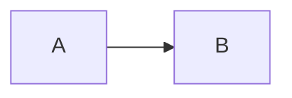

# Build-Time Mermaid Rendering Plan

## Goal

Render Mermaid code blocks to static SVG during `lildocs build`, instead of requiring browser-side Mermaid execution.

This should preserve the current authoring behavior:

````md

````

But generated HTML should contain ready-to-display SVG markup and should not load Mermaid from a CDN for successfully rendered diagrams.

## Current State

`src/core/markdown.ts` treats Mermaid as a special code block inside the `marked-shiki` highlighter:

```html
<pre class="mermaid">...</pre>
```

It returns `needsMermaid = true`.

`src/render/Layout.tsx` then emits:

- Mermaid CDN module script.
- `mermaid.initialize({ startOnLoad: true })`.

This works, but it means:

- Mermaid rendering requires client-side JavaScript.
- Static output depends on a CDN.
- Diagrams are not visible if JS is disabled.
- Mermaid failures happen in the browser instead of during build.

## Recommended Renderer

Use Mermaid's own package with a headless DOM implementation.

Recommended first pass:

- `mermaid`
- `happy-dom`

Reasoning:

- `mermaid` is the source renderer.
- `happy-dom` is lighter and simpler than browser automation.
- Avoid Playwright/Chromium unless Mermaid rendering is not reliable under `happy-dom`.

Alternative if DOM-based rendering proves unreliable:

- `@mermaid-js/mermaid-cli`

Do not choose Mermaid CLI initially. It pulls in browser automation weight and complicates installation.

## Desired Output

For each Mermaid block, output:

```html
<figure class="mermaidDiagram">
  <svg ...>...</svg>
</figure>
```

For accessibility:

- If the code fence has a title/meta value later, use it as `<figcaption>`.
- For now, add `role="img"` to the SVG wrapper where practical.
- Preserve readable fallback source in an HTML comment only if useful for debugging; do not show raw Mermaid source on successful render.

For invalid Mermaid:

- Fail the build by default with a clear diagnostic including source file path and diagram index.
- Consider a future `--mermaid.on-error warn` option, but do not add it initially.

## Architecture

Add:

```text
src/core/mermaid.ts
```

Suggested exports:

```ts
export type MermaidRenderOptions = {
  theme?: "default" | "dark" | "neutral" | "forest" | "base";
};

export type MermaidRenderer = {
  render: (source: string, idHint: string) => Promise<string>;
  close: () => Promise<void>;
};

export async function createMermaidRenderer(options?: MermaidRenderOptions): Promise<MermaidRenderer>;
```

`createMermaidRenderer` should:

1. Create a `happy-dom` window/document.
2. Install `window`, `document`, and required DOM globals for Mermaid.
3. Import and initialize Mermaid once.
4. Render diagrams with deterministic IDs.

## Markdown Pipeline Changes

Update `renderMarkdownPage` to accept a Mermaid renderer:

```ts
export type MarkdownRenderOptions = {
  mermaid?: MermaidRenderer;
};

export async function renderMarkdownPage(
  model: ContentModel,
  page: Page,
  outDir: string,
  options?: MarkdownRenderOptions,
): Promise<RenderedMarkdown>;
```

In the `marked-shiki` highlight hook:

- If `lang !== "mermaid"`, keep using Shiki.
- If `lang === "mermaid"`, call `options.mermaid.render`.
- Return the rendered SVG figure HTML.

Remove `needsMermaid` from the normal build path once all Mermaid blocks are rendered at build time.

Potential migration shape:

```ts
type RenderedMarkdown = {
  html: string;
  assets: AssetCopy[];
  text: string;
};
```

## Build Pipeline Changes

Update `src/core/build.ts`:

1. Create one Mermaid renderer per build.
2. Pass it into every `renderMarkdownPage` call.
3. Close the renderer after rendering finishes.
4. Stop tracking `siteNeedsMermaid`.
5. Call `renderPage` without Mermaid script flags.

Important: ensure the renderer is closed in a `finally` block.

## Layout Changes

Update `src/render/Layout.tsx`:

- Remove Mermaid CDN script emission.
- Remove `mermaid.initialize` script emission.
- Remove `needsMermaid` prop from `LayoutProps`.

Generated pages should contain only the existing search script, unless future features need more.

## Styling

Add minimal CSS to `src/render/styles.css`:

```css
.mermaidDiagram {
  overflow-x: auto;
}

.mermaidDiagram svg {
  max-width: 100%;
  height: auto;
}
```

Do not overstyle diagrams. Mermaid theme controls the internal diagram colors.

## Theme Strategy

Initial implementation:

- Use Mermaid's `default` theme.
- If the lildocs theme appears dark, consider `dark` later.

Do not couple Mermaid theme selection to Shiki themes in the first pass. That would expand the feature.

Future option:

```bash
--mermaid.theme default|dark|neutral|forest|base
```

## Deterministic IDs

Mermaid render calls need stable IDs.

Suggested ID format:

```text
ld-mermaid-${pageSlug}-${diagramIndex}
```

Use route-derived or source-path-derived slugs. Avoid absolute paths in IDs.

Tests should assert output is deterministic across repeated builds.

## Error Handling

Mermaid errors should include:

- Source Markdown file path.
- Diagram index on that page.
- Mermaid error message.

Add a project error type or use `LildocsError`:

```text
Failed to render Mermaid diagram 2 in docs/architecture.md: Parse error...
```

Do not silently fall back to client-side Mermaid in the first implementation. Silent fallback would hide build failures and keep CDN dependency.

## Dependencies

Add runtime dependencies:

```bash
pnpm add mermaid happy-dom
```

If Mermaid pulls in large transitive dependencies, this is still acceptable because Mermaid support is already a product requirement. Reassess only if install size becomes a release blocker.

## Tests

Update existing tests and add focused coverage.

### Update Existing Tests

Current test:

```text
emits mermaid enhancement when diagrams are present
```

Replace with:

```text
renders mermaid diagrams to svg at build time
```

Assertions:

- Generated HTML contains `<figure class="mermaidDiagram">`.
- Generated HTML contains `<svg`.
- Generated HTML does not contain Mermaid CDN URL.
- Generated HTML does not contain `mermaid.initialize`.
- Generated HTML does not contain raw `<pre class="mermaid">`.

### New Tests

Add or extend `test/static-output.test.mjs`:

- Multiple Mermaid diagrams on one page render to distinct SVGs.
- Mermaid in nested docs renders.
- Invalid Mermaid syntax fails with source path and diagram index.
- Non-Mermaid code blocks still use Shiki.
- Output is deterministic across two builds of the same docs.

If Mermaid rendering under `happy-dom` is slow, keep tests focused but do not skip them entirely.

## Manual Verification

Run:

```bash
pnpm test
pnpm run build
node dist/cli.mjs ./docs --out dist
```

Inspect:

- `dist/index.html` includes rendered SVG for the example Mermaid diagram.
- No Mermaid CDN script is emitted.
- Search still works.
- Shiki-highlighted code still works.

## Implementation Steps

1. Add `mermaid` and `happy-dom`.
2. Create `src/core/mermaid.ts`.
3. Add renderer setup and teardown.
4. Thread Mermaid renderer through `buildSite` and `renderMarkdownPage`.
5. Replace Mermaid code-block output with rendered SVG figures.
6. Remove `needsMermaid` from `RenderedMarkdown`, build, `renderPage`, and `Layout`.
7. Remove Mermaid script emission from layout.
8. Add Mermaid diagram CSS.
9. Update tests for build-time SVG output.
10. Add invalid Mermaid and deterministic output tests.
11. Run `pnpm run lint`, `pnpm run typecheck`, `pnpm test`, and `pnpm run format:check`.

## Risks

- Mermaid may require browser globals not implemented by `happy-dom`.
- Mermaid may produce nondeterministic IDs or timestamps unless configured carefully.
- SVG output may include inline styles that clash with page CSS.
- Rendering many diagrams may slow builds.

Mitigations:

- Keep Mermaid renderer isolated in one module.
- Normalize IDs.
- Add deterministic output tests.
- Reuse a single initialized renderer per build.

## Acceptance Criteria

- Mermaid diagrams render to SVG during build.
- Generated pages no longer load Mermaid from a CDN.
- Invalid Mermaid fails the build clearly.
- Existing Shiki code highlighting remains intact.
- Static output still works from disk.
- Tests cover successful rendering, invalid syntax, nested pages, and deterministic output.
